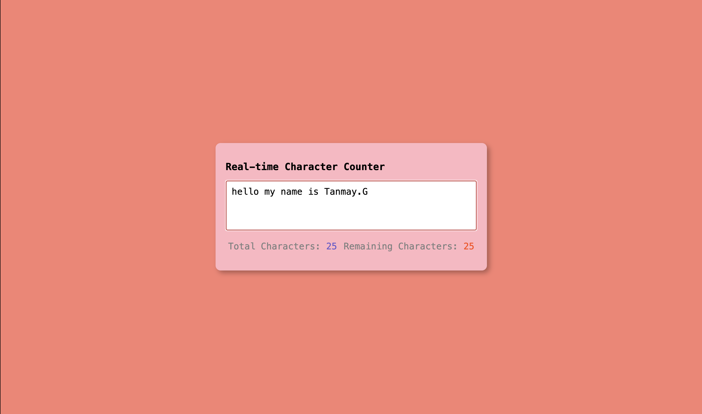

# Real-time Character Counter

A simple and interactive web application that counts characters in real-time as you type. This project helps users track the number of characters they've entered and how many characters they have remaining based on a maximum limit.

## Features

- Real-time character counting
- Displays total characters typed
- Shows remaining characters allowed
- Maximum character limit of 50 characters
- Clean and intuitive user interface

## Technologies Used

- HTML5
- CSS3
- JavaScript (Vanilla)

## How to Use

1. Open the `index.html` file in your web browser
2. Start typing in the text area
3. Watch as the character count updates in real-time
4. The remaining counter will show how many more characters you can type

## Project Structure

```
Real-time Char counter/
├── index.html
├── index.js
└── README.md
```

## Screenshot



## Contributing

Feel free to fork this repository and submit pull requests for any improvements.

## License

This project is open source and available under the MIT License. 
